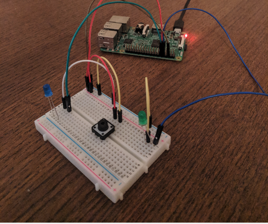

# pomo-timer
- This is a pomodoro timer I made for my raspberry pi. I connected a blue and a green led light. When I push the button on my breadboard it lights the blue light for 25 minutes and prints a 25 minute countdown to my console. Once 25 minutes have passed I then call my timer function again. This time my green led will light up, turn off the blue led, and give me a 5 minute countdown.

